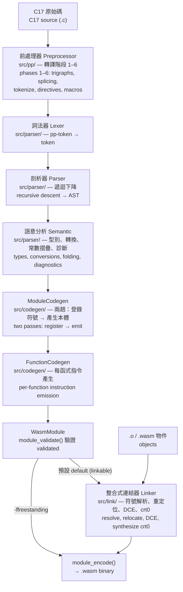

# 降階管線 Lowering Pipeline

本文說明 wvmcc 如何將一份 C17 原始檔一路降階為 WasmVM 的 `WasmModule`，涵蓋各階段的
職責、雙記憶體模型、wasm64 ABI 規則，並以 `int add(int a, int b)` 的實際輸出作結。

This document walks through how wvmcc lowers a single C17 source file all the way down to a
WasmVM `WasmModule` — the responsibilities of each stage, the dual-memory model, the wasm64 ABI
rules, and a worked `int add(int a, int b)` example using the compiler's real output.

> 本文為架構概覽；程式碼產生的實作細節見 [`codegen.md`](codegen.md)，降階設計決策見
> [`lowering-plan.md`](lowering-plan.md)，資料模型與 ABI 見 [`spec.md`](spec.md)。
>
> This is the architectural overview. For code-generation internals see [`codegen.md`](codegen.md),
> for lowering design decisions see [`lowering-plan.md`](lowering-plan.md), and for the data model
> and ABI see [`spec.md`](spec.md).

---

## 架構總覽 Architecture overview

整條管線都住在同一個 `wvmcc` 執行檔內——沒有外部組譯器、沒有外部連結器。每個 `.c` 輸入
在記憶體中依序流過下列各階段；`.o`/`.wasm` 輸入則直接進入連結器。

The entire pipeline lives in the single `wvmcc` binary — no external assembler, no external linker.
Each `.c` input streams through the stages below in memory; `.o`/`.wasm` inputs enter the linker
directly.



驅動程式 (`src/exec/main.cpp`) 每個 `.c` 輸入用一個全新的 `Preprocessor`，把上半段
（前處理→驗證）串起來，再視編譯模式把結果送進連結器或直接編碼。

The driver (`src/exec/main.cpp`) runs the front half (preprocess → validate) with a fresh
`Preprocessor` per `.c` input, then either hands the result to the linker or encodes it directly,
depending on the compile mode.

| 階段 Stage | 位置 Location | 輸入 → 輸出 In → Out |
|---|---|---|
| 前處理器 Preprocessor | `src/pp/` | 字元流 bytes → pp-token 串流 stream |
| 詞法器 Lexer | `src/parser/` | pp-token → 語言 token language token |
| 剖析器 Parser | `src/parser/` | token → AST |
| 語意分析 Semantic | `src/parser/` | AST → 帶型別的 AST typed AST |
| ModuleCodegen | `src/codegen/` | 帶型別的 AST typed AST → `WasmModule` |
| FunctionCodegen | `src/codegen/` | 函式 AST func AST → `WasmFunc` |
| 連結器 Linker | `src/link/` | 多個模組/物件 modules/objects → 單一 `WasmModule` |

### 兩趟式 ModuleCodegen Two-pass ModuleCodegen

`ModuleCodegen::generate` 先跑 **第一趟**——登錄所有檔案範圍符號（函式的匯入/定義、
全域變數），讓每個定義在產生本體前都已知其索引與型別；再跑 **第二趟**——實際產生每個
函式的本體。這使得前向參照（函式先呼叫、後定義）不需額外處理即可運作。

`ModuleCodegen::generate` runs a **first pass** that registers every file-scope symbol (function
imports/definitions, global variables), so every definition's index and type is known before any
body is emitted; then a **second pass** emits each function body. Forward references (call a
function defined later) therefore work without special handling.

---

## 雙記憶體模型 Dual-memory model

wvmcc 產生的每個模組至少宣告 **兩塊 wasm64 線性記憶體**。指標是 64 位元位移，指令
以 `memidx` 選擇要對哪一塊記憶體讀寫。

Every module wvmcc emits declares at least **two wasm64 linear memories**. Pointers are 64-bit
offsets, and instructions select which memory to read/write via a `memidx`.

```
memidx  用途 Purpose
─────   ─────────────────────────────────────────────────────
  0     堆積 + 靜態資料 Heap + static data (i64 addresses)
        [0..8)          null 哨兵 null-pointer sentinel (reserved)
        [8..__heap_base) 靜態資料 static data: 聚合體、字串字面值 aggregates, string literals
        [__heap_base..)  未來的堆積 future heap (malloc)
  1     影子堆疊 Shadow stack (i64 addresses, 向下成長 grows downward)
        取址的區域變數、聚合區域變數的呼叫框
        call frames for address-taken locals and aggregate locals
 2–14   以 __attribute__((wvmcc_memidx(N))) 明確放置的物件
        objects explicitly placed via __attribute__((wvmcc_memidx(N)))
   15   保留 Reserved — 函式指標標記 the function-pointer tag; 從不是資料記憶體
        never a data memory, so NULL (0) is never a valid function pointer
```

- **mem[0] — 堆積與靜態資料 Heap & static data.** 純量全域、字串字面值、聚合常數都放這裡。
  前 8 個位元組保留，使 null 指標（全零）永遠不指向真實物件。可變全域
  `__heap_base` 記錄靜態資料的結尾。
  Scalar globals, string literals, and aggregate constants live here. The first 8 bytes are
  reserved so a null pointer (all-zero) never aliases a real object. The `__heap_base` global marks
  where static data ends.

- **mem[1] — 影子堆疊 Shadow stack.** 大多數純量區域變數住在 wasm 的 `local`（暫存器式，
  無位址）。但**被取址**的區域變數（`&x`）與**聚合**區域變數（struct/陣列）需要真實位址，
  因此配置在向下成長的影子堆疊上。一個可變 i64 全域充當堆疊指標，函式進入時遞減、離開時還原。
  Most scalar locals live in wasm `local`s (register-like, no address). But **address-taken**
  locals (`&x`) and **aggregate** locals (structs/arrays) need real addresses, so they are allocated
  on the downward-growing shadow stack. A mutable i64 global acts as the stack pointer, decremented
  on entry and restored on exit.

### 標記指標：跨記憶體解參 Tagged pointers: cross-memory dereference

一個 C 指標值必須不論其目標位於哪塊記憶體都能運作，但解參處（`*p`、`p->m`、`p[i]`）無法在
編譯期得知指標指向 mem[0] 還是 mem[1]。解法：指標**值**在 i64 高位（bit 60）攜帶目標
`memidx`，低 60 位保存位元組位移。

A C pointer value must work regardless of which memory its target lives in, but the dereference
site (`*p`, `p->m`, `p[i]`) cannot statically know whether the pointer targets mem[0] or mem[1].
The fix: a pointer **value** carries its target `memidx` in the high bits (bit 60) of the i64,
with the low 60 bits holding the byte offset.

- 取址（`&local`、陣列/聚合退化）會 OR 入物件的標記；mem[0]（nibble 0）無需標記。
  Taking an address ORs in the object's tag; mem[0] (nibble 0) needs none.
- **具名**左值解析到靜態已知的記憶體，直接以該 memidx 讀寫。
  A **named** lvalue resolves to a statically known memory and uses a direct load/store.
- **不透明**指標左值（解參、`->`、指標索引、呼叫結果、轉型、指標算術）在執行期依 nibble
  分派：判斷 nibble → 遮去標記 → 從選中的記憶體讀寫。
  An **opaque** pointer lvalue is dispatched at runtime by branching on the nibble, masking it off,
  then loading/storing from the selected memory.

這正是讓「`&local` 傳給輔助函式」慣用法運作的機制（issue #78），細節見
[`codegen.md`](codegen.md) 的 *Tagged pointers* 段落。

This is what makes the "`&local` passed to a helper" idiom work (issue #78); see the *Tagged
pointers* section of [`codegen.md`](codegen.md) for the full mechanism.

---

## wasm64 ABI 規則 wasm64 ABI rules

wvmcc 以 wasm64 為目標，採 **LP64** 資料模型：

wvmcc targets wasm64 with the **LP64** data model:

| C 型別 C type | 大小 Size | Wasm | 備註 Notes |
|---|---|---|---|
| `char` | 1 | `i32` | 預設有號 signed by default (`-funsigned-char` 待實作 planned) |
| `short` | 2 | `i32` | |
| `int` | 4 | `i32` | |
| `long`, `long long` | 8 | `i64` | |
| 指標 pointer, `size_t`, `ptrdiff_t` | 8 | `i64` | 高位攜帶 memidx 標記 high bits carry the memidx tag |
| `float` | 4 | `f32` | IEEE-754 binary32 |
| `double`, `long double` | 8 | `f64` | `long double` 別名為 `double` aliased to `double` |
| `_Bool` | 1 | `i32` | `true`=1、`false`=0；非零轉為 1 nonzero → 1 |

規則要點 Key rules:

- **指標即 i64 Pointer = i64.** 每個指標值都是 64 位元、標記式（見上）；`sizeof(void*) == 8`。
  Every pointer value is a 64-bit tagged word (above); `sizeof(void*) == 8`.
- **聚合以參照傳遞 Aggregates by reference.** struct/union/陣列不進 wasm 運算堆疊；它們住在
  線性記憶體，以（標記式）i64 位址傳遞與回傳。純量參數/回傳值則走 wasm 的值堆疊。
  structs/unions/arrays never travel on the wasm operand stack; they live in linear memory and are
  passed and returned by (tagged) i64 address. Scalar params/returns use the wasm value stack.
- **小端 Little-endian**，自然對齊（1/2/4/8）。natural alignment (1/2/4/8).
- **可變參數 Variadics** 依 C17 預設引數升級（`float`→`double`、小整數→`int`）。
  follow C17 default argument promotions (`float`→`double`, small integers→`int`).
- **列舉 enums** 底層型別為 `int`，除非其值超出範圍。underlying type is `int` unless values exceed range.

完整的實作定義行為（`char` 有號性、浮點準確度、`math_errhandling` 等）見
[`spec.md`](spec.md)。

The full set of implementation-defined behaviors (`char` signedness, floating-point accuracy,
`math_errhandling`, …) is in [`spec.md`](spec.md).

---

## 逐行範例 Worked example: `int add(int a, int b)`

給定 Given:

```c
int add(int a, int b) {
    return a + b;
}
```

以獨立式模式編譯 Compile in freestanding mode:

```sh
wvmcc -ffreestanding -o add.wasm add.c
readwasm add.wasm
```

wvmcc 產生的完整模組 The complete module wvmcc emits:

```wat
(module
  (type (func (param i32 i32) (result i32)))   ;; add 的型別 add's signature — int,int → int
  (func (type 0)
    local.get 0      ;; 推入參數 a（區域 0，int→i32）push param a (local 0, int→i32)
    local.get 1      ;; 推入參數 b（區域 1）           push param b (local 1)
    i32.add          ;; a + b（int 算術 → i32.add）    a + b (int arithmetic → i32.add)
    return           ;; 回傳堆疊頂端                    return the value on top of stack
    i32.const 0      ;; 落底預設值——湊足結果型別，永不執行
  )                  ;; fall-through default — satisfies the result type, never reached
  (memory i64 1)     ;; mem[0]：堆積 + 靜態資料 heap + static data (wasm64, 1 頁 page)
  (memory i64 1)     ;; mem[1]：影子堆疊 shadow stack
  (global (mut i64) i64.const 65536)  ;; 影子堆疊指標，起於 mem[1] 頂端 stack ptr = top of mem[1] (64 KiB)
  (global i64 i64.const 8)            ;; __heap_base = 8（8-byte null 哨兵之後 after null sentinel）
)
```

觀察要點 Things to notice:

- 兩個 `int` 參數各對映到一個 i32 `local`；沒有變數被取址，所以完全不動用影子堆疊。
  Each `int` param maps to one i32 `local`; no variable is address-taken, so the shadow stack is
  untouched.
- `a + b` 是 `int` 算術，降為 `i32.add`——若換成 `long`（i64）則會是 `i64.add`。
  `a + b` is `int` arithmetic, lowered to `i32.add` — with `long` (i64) operands it would be
  `i64.add` instead.
- 即使 `return` 已交出值，函式仍以 `i32.const 0` 落底：wasm 要求函式的最後一刻在堆疊上留下
  結果型別的值，這是永不執行的預設值。
  The function ends with a fall-through `i32.const 0` even though `return` already yields a value:
  wasm requires the function's end to leave a value of the result type on the stack; this default is
  never reached.
- 即便這支函式一個位元組的記憶體都沒用到，兩塊記憶體與兩個全域仍會出現——它們是每個模組的
  ABI 骨架（見上方雙記憶體模型）。
  Both memories and both globals appear even though this function touches zero bytes of memory —
  they are the per-module ABI scaffold (see the dual-memory model above).

### 連結後 After linking

在預設（可連結）模式下，加入 `main` 並與 libc 連結時，連結器會解析符號、套用重定位、
消除無用程式碼，並合成一個呼叫 `main` 的 `crt0` 進入點：

In the default (linkable) mode, when a `main` is added and linked against libc, the linker resolves
symbols, applies relocations, eliminates dead code, and synthesizes a `crt0` entry point that calls
`main`:

```sh
wvmcc --sysroot=build/runtime -o app.wasm app.c   # 隱含連結 libc + crt0 links libc + crt0
wasmvm app.wasm                                    # 執行 run; 行程結束碼 = main 的回傳值 exit code = main's return
```
