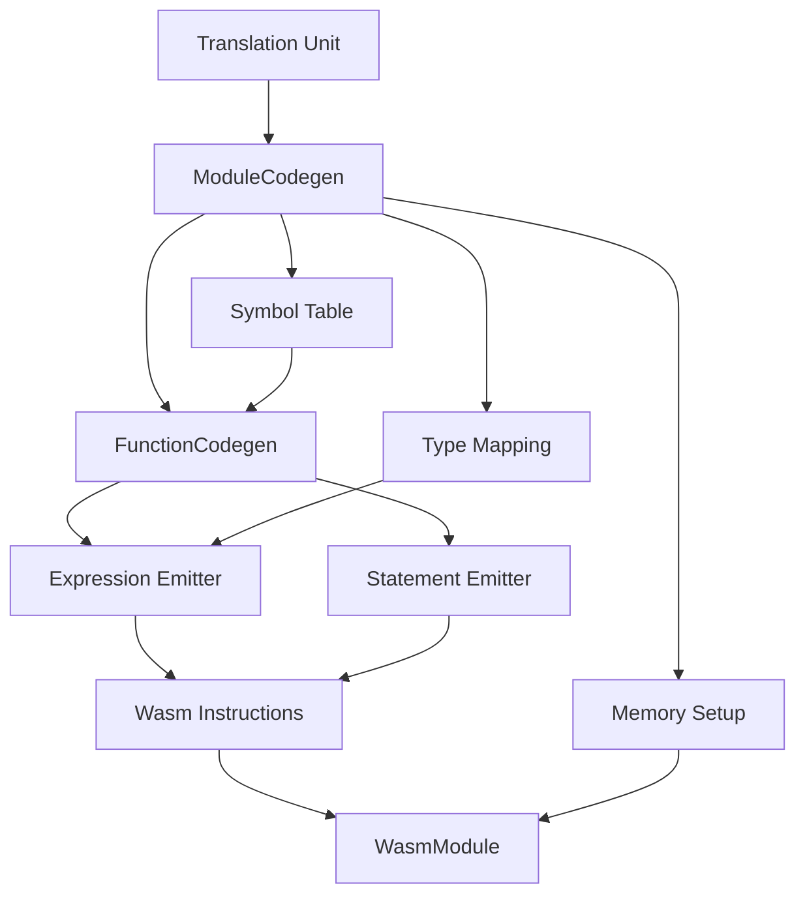

# Phase 1 Implementation Plan: Scalar Foundation

## Overview
This plan outlines the detailed implementation subtasks for Phase 1 of the lowering plan, which aims to compile `int add(int a, int b) { return a+b; }` to a valid `.wasm` file.

## Subtasks

### Step 1.1 — Build Infrastructure (No Codegen Yet)
- [ ] Create `src/codegen/` directory
- [ ] Implement `TypeMap.hpp/.cpp` with:
  - `toWasmType(TypeNodePtr)` function
  - `byteSize()` function
  - `byteAlignment()` function  
  - `isMemoryResident()` function
  - `makeLoad(type, memidx)` function
  - `makeStore(type, memidx)` function with Wasm64 rules (pointer/long → i64, int → i32)
- [ ] Implement `SymbolTable.hpp` with:
  - `VarInfo` variant structure
  - Scope-stack implementation (`pushScope`/`popScope`/`define`/`lookup`)
- [ ] Implement `TypeIndexCache.hpp` with:
  - `intern(FuncType)` function with deduplication
- [ ] Implement `GlobalDataAllocator.hpp` with:
  - `allocate(size, align)` function
  - `internString()` function
  - `currentTop()` function
- [ ] Update `CMakeLists.txt` to add `${SRC_ROOT}/codegen/*.cpp` to source glob

### Step 1.2 — ModuleCodegen Skeleton
- [ ] Implement `ModuleCodegen.hpp/.cpp` with:
  - Constructor
  - `generate()` shell function
- [ ] Emit two `MemType` entries:
  - `mem[0]` (heap/static, 1 page min, `is64=true`)
  - `mem[1]` (shadow stack, 1 page min, `is64=true`)
  - Indices 2–15 reserved
- [ ] Emit `__stack_pointer` mutable i64 global (init = top of `mem[1]`, e.g. `0x10000`)
- [ ] First pass implementation:
  - Iterate TU externals
  - Register every function definition and `extern` function declaration in `symtab_` and `mod_.imports`/`mod_.funcs`
  - Export all non-`static` functions
  - Register file-scope scalar variables as `WasmGlobal` (i64, mutable, init 0)
- [ ] Second pass placeholder:
  - Leave function bodies empty for now

### Step 1.3 — FunctionCodegen Skeleton + Integration
- [ ] Implement `FunctionCodegen.hpp/.cpp` with:
  - Constructor
  - `generate()` shell function
  - `allocLocal()` function
  - `emit()` function
- [ ] Wire `generate()` into `ModuleCodegen` second pass
- [ ] Patch `src/exec/main.cpp:208`:
  - Replace empty `WasmModule` with `ModuleCodegen::generate(tu)`
  - Surface `module_validate` errors as diagnostics
- [ ] Ensure build compiles (empty function bodies → just `End`)

### Step 1.4 — Expression Lowering (Scalars)
- [ ] Implement `emitExpr` for:
  - `Integer`, `Char` → `I32_const`; string/pointer-sized integer → `I64_const`
  - `Ident` (ScalarLocal) → `Local_get`
  - `Ident` (GlobalScalar) → `Global_get`
  - Arithmetic `Binary` (`+`, `-`, `*`, `/`, `%`, `&`, `|`, `^`, `<<`, `>>`) with i32 and i64 variants selected by operand type
  - Comparison `Binary` (`==`, `!=`, `<`, `>`, `<=`, `>=`) → i32 result
  - Unary `-`, `~`, `!`, `+`
  - `Cast` → emit conversion instructions (`I64_extend_i32_s`, `I32_wrap_i64`, `F32_convert_i64_s`, etc.)

### Step 1.5 — Statement Lowering (Basic Control Flow)
- [ ] Implement `emitStmt` for:
  - `Return` (with and without value)
  - `Expr` statement (emit expr, `Drop` result)
  - `Compound` (push/pop scope, iterate block items)
  - `If` / `If-Else` → `If` / `Else` / `End`
  - `While` → `Block` + `Loop` + `Br_if` + `Br` + `End End`
  - `For` → init block-item + same pattern as `while`
- [ ] Implement `emitBlockItem` for:
  - `Declaration` → allocate `ScalarLocal` (i32 or i64 by type), emit initializer if present

### Step 1.6 — Direct Function Calls
- [ ] Implement `emitExpr` for:
  - `Call` with identifier callee → emit args, `Call{funcIdx}`
- [ ] Verify call site type matches registered `FuncType`

### Step 1.7 — Verification
- [ ] Compile `int add(int a, int b) { return a+b; }` → `module_validate()` returns no error
- [ ] Inspect output with `readwasm --func --type output.wasm` to confirm correct function type and body
- [ ] Run existing parser/semantic unit tests — all pass
- [ ] Smoke-test `extern` import: compile `extern int puts(int s); int greet() { return puts(0); }` → `module_validate()` passes

## Mermaid Diagram: Phase 1 Architecture

## Integration Points
- `src/exec/main.cpp` lines 207–208: Replace empty module construction with `ModuleCodegen::generate(tu)`
- `CMakeLists.txt`: Add `${SRC_ROOT}/codegen/*.cpp` to source glob